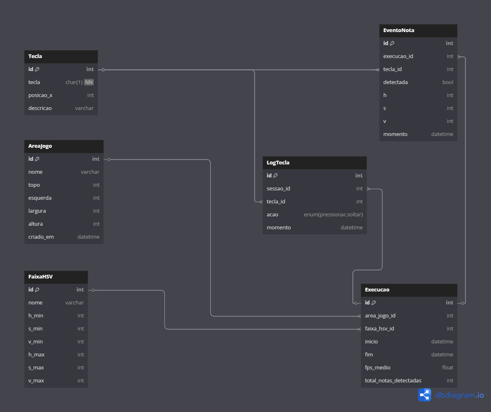
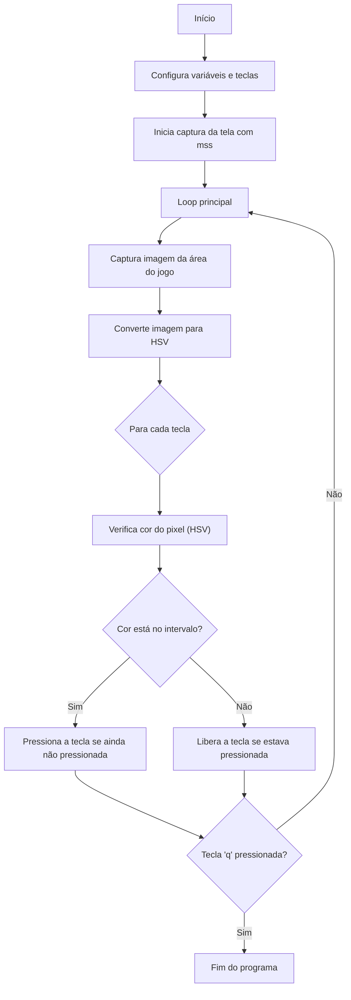

<h1 align="center">🎸 Guitar Flash Bot 🎸</h1>

<p align="center">
  
</p>

## 🔧 Visão Geral

O **bot_guitar_flash** é um bot automatizado, feito em python, para o jogo [Guitar Flash 3](https://guitarflash3.com/) , que detecta as notas da tela e simula o pressionamentos das teclas correspondentes a cada nota no jogo. 

📗 **O bot utiliza as bibliotecas** :

- `mss` para captura de tela em tempo real.
- `OpenCV` para conversão e análise de imagem no espaço de cores HSV.
- `keyboard` para simular pressionamento de teclas.

⚙️ **Como funciona**:
- **Detecção de Pixels**: A cada ciclo, a imagem da tela é capturada, convertida para o espaço de cores HSV, e os pixels de interesse são analisados para verificar se correspondem a uma nota. Se uma nota for detectada, o código simula o pressionamento da tecla correspondente.

- **Função** `is_note_detected`: Essa função verifica se a cor do pixel está dentro do intervalo de cores definido pelas variáveis `lower_hsv` e `upper_hsv`. Caso esteja, isso indica que a nota foi detectada.

## 👷🏽‍♂️Arquitetura

Abaixo estão os diagramas ilustrando o fluxo da aplicação e sua arquitetura.


<p align="center">
   
</p>

- **`AreaJogo`**  
  Define a área da tela onde o jogo é capturado.

- **`Tecla`**  
  Representa cada tecla usada no jogo, com sua posição na tela e descrição.

- **`FaixaHSV`**  
  Define os valores HSV utilizados para detectar as notas visuais na tela.

- **`Execucao`**  
  Representa uma execução completa do bot (início, fim, FPS, total de notas, etc.).

- **`EventoNota`**  
  Registra cada tentativa de detecção de uma nota durante a execução, com dados de cor HSV e momento.

- **`LogTecla`**  
  Registra os momentos em que cada tecla foi pressionada ou solta durante a execução.




## 🚀Como usar

1. Clonar repositório:
```bash
git clone https://github.com/asegnibo/bot_guitar_flash.git
```
2. Baixar bibliotecas necessárias
```bash
pip install mss
```
```bash
pip install opencv-python
```
```bash
pip install numpy
```
```bash
pip install keyboard
```
3. Ajuste na área do jogo: Você deve inserir os índices (top, left, width e height) na variável **`game_area`**. Se necessário, ajuste essas coordenadas conforme seu monitor, obtendo os índices utilizando o arquivo *cursor_position*

4. Configuração das teclas: Por padrão, o jogo utiliza as teclas (a, s, j, k, l). Caso queira alterar, basta alterar em **`keys`**.

5. Selecionar os circulos de identificação. Utilize o arquivo py *cursor_position* para configurar a váriavel **`x_offsets`** e escolha um único valor para **`y_line`** para o qual os pontos fiquem conforme a imagem abaixo.
<p align="center">
  
</p>

6. Rodar o código. Dentro da pasta do repositório clonado, execute o código com o comando:
```bash
python bot_gf3.py
```

7. Parar o Programa: pressione a tecla *q*


